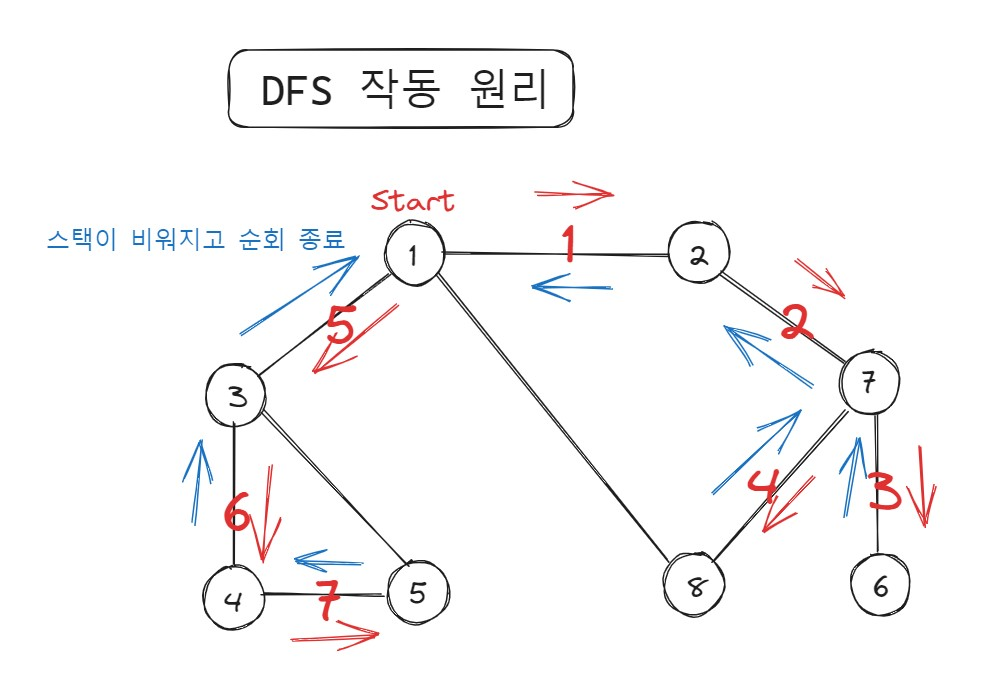

# 그래프 탐색 (DFS/BFS)

## 목차

1. 기본 개념

## 1. 기본 개념

### 1.1. 스택

스택은 list와 append, pop 연산을 통해 쉽게 구현할 수 있다

- 스택 오버플로 : stack size를 초과하는 삽입 연산 수행 시 발생하는 에러
- 언더플로 : 스택이나 큐에 데이터가 없는데 삭제 연산 수행 시 발생하는 에러

### 1.2. 큐

Python에서 큐를 구현할 때는 collections 모듈의 deque (덱) 자료구조를 활용한다

- 덱은 스택과 큐의 모든 기능을 활용할 수 있고
- 데이터 삽입, 삭제가 리스트 자료형보다 빠르다
- queue 라이브러리보다 간편하게 사용할 수 있다

deque를 활용한 Queue 구현 : `queue.py`

### 1.3. 재귀

컴퓨터 내부에서 재귀 함수의 수행은 스택 자료구조를 이용

- 함수를 계속 호출했을 때, 가장 마지막에 호출한 함수가 먼저 수행을 끝내야 그 앞의 함수 호출이 종료되기 때문
- 따라서 스택 자료구조를 활용해야 하는 알고리즘은 거의 재귀로도 해결할 수 있음
    - 예) DFS..

### 1.4. DFS(깊이 우선 탐색)

#### 그래프 탐색

그래프를 컴퓨터로 표현할 때, `인접 행렬` 또는 `인접 리스트` 형태로 표현한다

#### 인접 행렬

- 2차원 배열에 각 노드가 연결된 형태를 기록
- 연결되지 않은 노드는 무한의 거리(비용)이라고 생각한다


- 장점: 특정 노드 간의 인접 여부를 빠르게 확인할 수 있다
- 단점: 메모리를 많이 차지한다 (연결되지 않은 노드간의 정보도 저장)

```py
INF = 1e9  # 10^9

# 노드가 3개인 그래프의 인접 행렬
adjacency_matrix = [
    [0, 1, 2],
    [1, 0, INF],
    [2, INF, 0]
]
```

#### 인접 리스트

- 2차원 배열에 각 노드에 연결된 노드만 기록
- Python 에서는 인접 리스트를 list(연결 리스트) 로 구현


- 장점: 메모리를 적게 차지
- 단점: 특정 노드 간의 인접 여부 확인에 시간이 걸림

```py
# 노드가 3개인 그래프의 인접 리스트
adjacency_list = [[] for _ in range(3)]

adjacency_list[0].append((1, 1))
adjacency_list[0].append((2, 2))

adjacency_list[1].append((0, 1))

adjacency_list[2].append((0, 2))

print(adjacency_list)  # [ [ (1, 1), (2, 2) ], [ (0, 1) ], [ (0, 2) ] ]
```

#### DFS 동작 과정

1. 탐색 시작 노드를 스택에 삽입하고 방문 처리한다
2. 스택의 최상단 노드(tail) 의 인접 노드들 중에 미방문 노드가 있으면 미방문 노드를 스택에 넣고 방문 처리한다. 미방문 노드가 없으면 스택에서 최상단 노드를 꺼낸다
3. 2번의 과정을 더 이상 수행할 수 없을 때까지 반복한다



구현 상세 : `dfs.py`

- 노드 갯수가 N개이면 O(N)의 시간 복잡도 소요